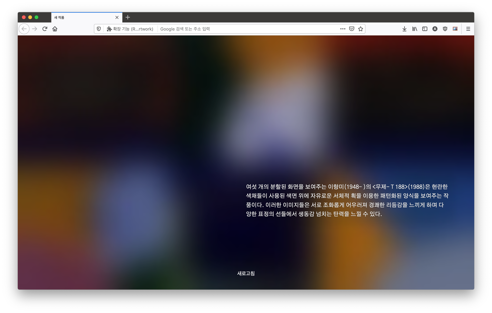

# 새 작품 탭

새 탭을 열면 국립현대미술관(MMCA)과 서울시립미술관(SeMA) 소장품 온라인 컬렉션 중 한 작품 설명과 링크를 랜덤으로 보여줍니다. 작품 이미지는 저작권 보호 대상이기 때문에 직접 보여주지 않고 흐리게 처리한 이미지가 보입니다. 설명 텍스트를 눌러 각 미술관의 작품 상세 페이지로 가면 작품 이미지를 자세히 볼 수 있습니다.

이 확장프로그램은 제가 개인적으로 사용할 목적으로 만들었고, 국립현대미술관이나 서울시립미술관과 무관하며 이들 기관에서 제작하거나 관리하지 않습니다.

구글폰트와 작품정보 API 데이터를 읽어오기 위해 웹 요청 권한을 사용하며, 작품 정보 데이터를 읽어오기 위해 아마존 AWS API를 호출합니다.

- 국립현대미술관 웹사이트: https://www.mmca.go.kr/
- 서울시립미술관 웹사이트: https://sema.seoul.go.kr/
- 확장프로그램 아이콘 출처: https://openmoji.org/
